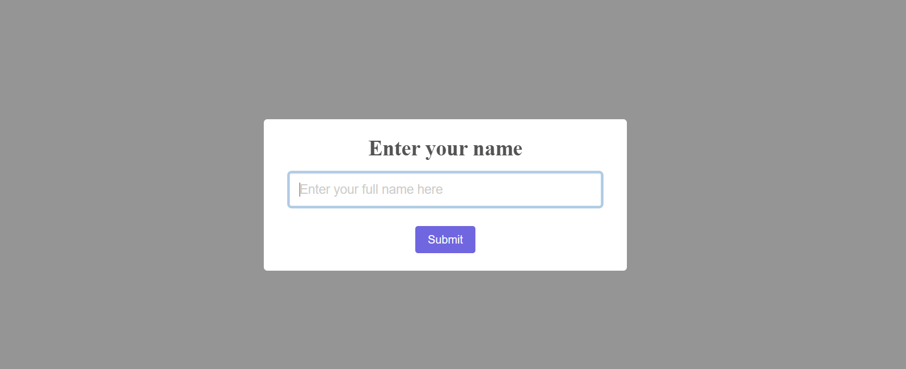
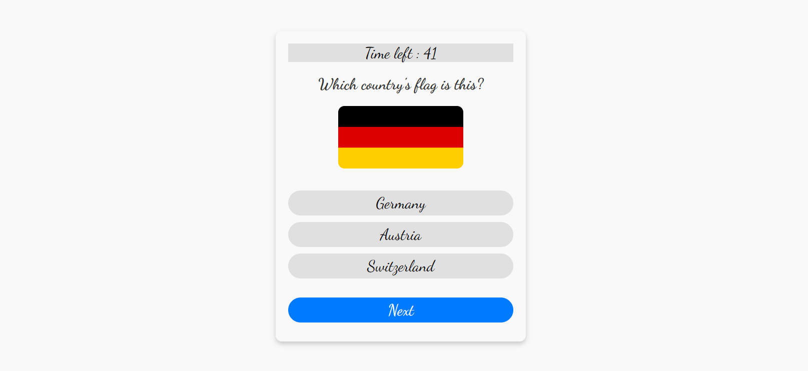
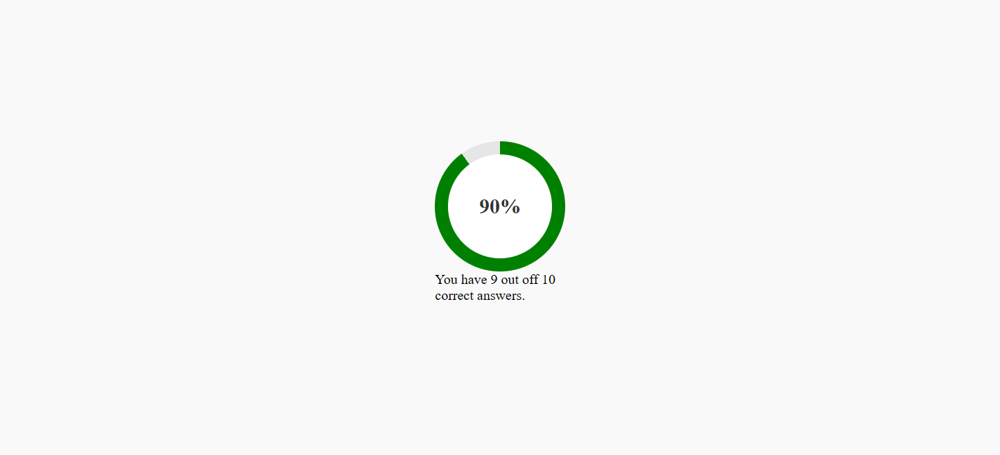

Simple Examinations System

Overview

The Simple Examinations System is a web-based application designed to provide a multiple-choice exam experience. It includes a timer, randomized questions and answers, and an intuitive interface for students.

Features

Student Name Input: A popup library is used to take the student’s name before starting the exam.

Randomized Questions & Answers: Each exam session presents a shuffled set of questions and randomized answer choices.

Single-Question Display: One question appears at a time, with a "Next" button for navigation.

Answer Selection: Only one answer can be selected per question, with a visual indicator (gray background) for the chosen answer.

Exam Timer: A progress bar displays the remaining time (1 minute per question).

Result Display: At the end, the student's result is shown either when all questions are answered or when the timer expires.

Screenshots

Here are some screenshots of the project:

The home page where the student enters their name:

An example of a question displayed during the exam:

The final results page showing the student’s score:

Future Enhancements

Add more question sets.

Implement a backend for storing results.

Enhance UI with animations.

Enjoy your exam! 🚀
